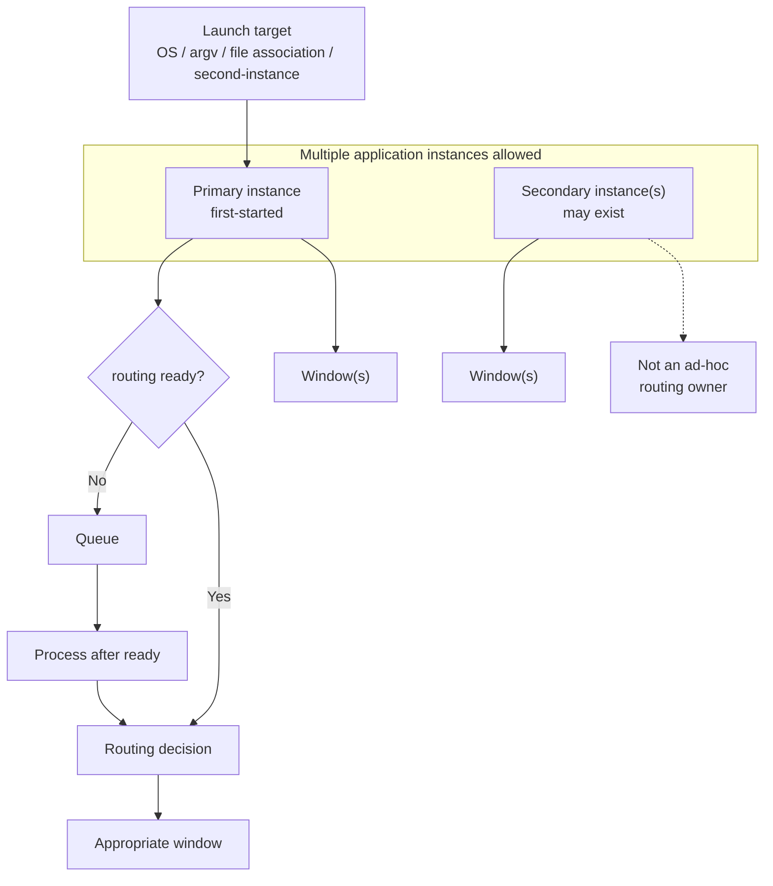
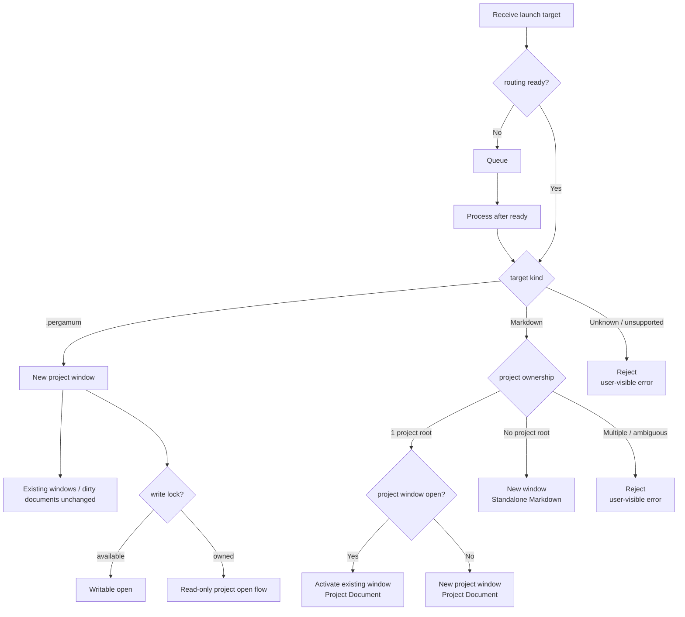
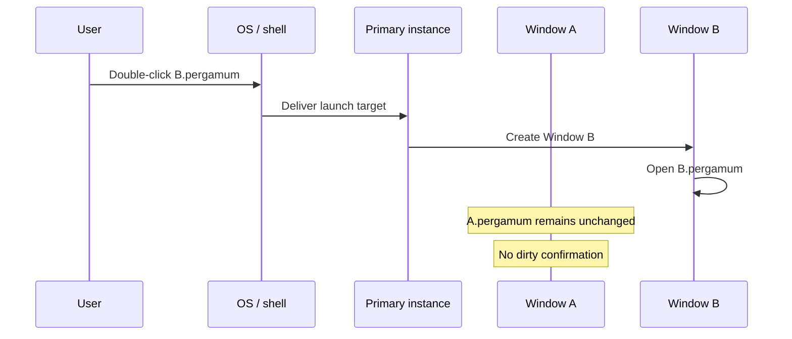
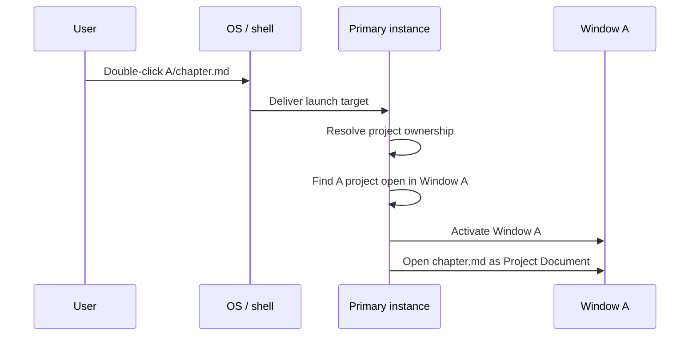
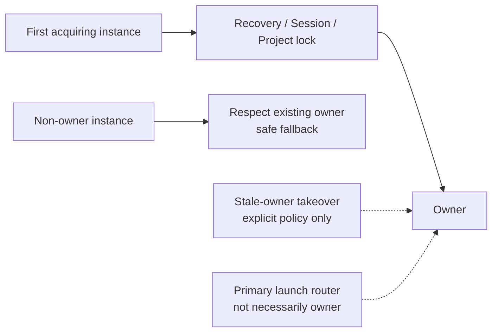

# ADR-0012: Application Instance and Launch Target Routing Policy

**Status:** Proposed

**Date:** 2026-09-02

> On Status: this ADR records the policy / architecture decision from Issue #278. The actual `second-instance` wiring, primary handoff, routing queue, and window registry are not implemented and are delegated to follow-up Issues. Promotion to Accepted will be considered after PO review.

---

## Context

Pergamum's current implementation is roughly:

```text
1 process
  └ 1 BrowserWindow
      └ 1 Session
```

At the same time, Pergamum has not adopted a strict single-app-instance model, so multiple application processes can run at the same time.

```text
Pergamum process A
  └ Session A

Pergamum process B
  └ Session B
```

#272 introduced Session restore-set persistence, so multiple processes can persist multiple Sessions into the restore set. #274 kept cold start aligned with the current single-window architecture by restoring at most one Session. ADR-0010 defined cold-start file-open routing, while leaving runtime `second-instance`, macOS `open-file`, existing-window focus / routing, and an instance registry as future work.

Issue #278 defines that remaining area: **when Pergamum is already running and a launch target arrives from the OS / command line / file association, which process / window / Session should receive it**.

This ADR adds no implementation. It fixes the application instance model and launch target routing policy first, so follow-up implementation Issues do not add ad-hoc routing policies.

### Conceptual Overview

The following diagram shows the relationship between application instances, primary routing, routing readiness, the queue, and windows.



---

## Related ADRs

- **ADR-0003 UI Interaction Architecture** - used as a premise for the renderer / main boundary and the separation of project state, current document state, and open document state. This ADR does not change ADR-0003 frozen interaction invariants.
- **ADR-0006 Durable State Categories and Settings Architecture** - used as a premise that session / recovery / runtime coordination are categories separate from settings.
- **ADR-0007 Recovery and Runtime Coordination** - used as a premise for multi-instance Recovery separation and the rule that runtime coordination markers are advisory signals, not hard locks. This ADR does not redesign Recovery ownership.
- **ADR-0008 Project File, Project Root, and Project-Local Recovery Layout** - used as a premise for the `.pergamum` project file, project root, project boundary, `metadata.project_id`, and project root as the unit of locking / multi-open detection.
- **ADR-0009 Working Copy Persistence and Recovery Model** - this ADR does not change the non-destructive working-copy Recovery contract, the separation of `sessionId` and `instanceRunId`, or the multi-instance claim policy.
- **ADR-0010 Startup File-Open Routing (Cold Start)** - used as a premise for cold-start `.pergamum` / Markdown routing, URL-like input rejection, and the safety condition that project-owned Markdown must not fall back to standalone writable. This ADR defines the runtime / already-running instance routing policy that ADR-0010 left as future work.

---

## Definitions

**Application instance**

One Pergamum application process / run. It corresponds to the execution unit represented by `instanceRunId`. One application instance may contain multiple windows in the future, but an application instance, a window, and a Session are not the same concept.

**Primary instance**

The first-started reachable Pergamum application instance. It acts as the representative entry point for launch target routing. This ADR does not define the concrete primary liveness / stale-primary takeover conditions.

**Launch target**

A file-open request delivered from the OS / command line / file association / Electron `second-instance` style handoff / future macOS `open-file`. The target is either a `.pergamum` project file or a Markdown file.

**Routing ready**

The lifecycle point at which the primary instance has completed startup / Session restore enough to safely execute incoming launch-target routing decisions. The concrete ready condition is defined by a follow-up Issue.

**Project Document / Standalone Markdown**

This ADR uses the document-kind definitions from ADR-0010. A Project Document is a Markdown document owned by a Pergamum project. Standalone Markdown is an external Markdown document that is not owned by a project.

---

## Decision

### Application instance model

**AIR-1. Pergamum allows multiple application instances.**

Pergamum does not adopt a strict single-app-instance model. The existence of multiple application processes / runs is an accepted condition.

**AIR-2. File-open launch targets are routed to the first-started primary instance when possible.**

File-open requests delivered through OS file association, command line, Electron `second-instance` style launch targets, and future macOS `open-file` are delivered to the first-started primary instance when possible.

This is not strict single-instance enforcement. The primary instance is the representative entry point for launch target routing; it does not prohibit other application instances from existing.

**AIR-3. The primary instance owns launch-routing decisions.**

When the primary instance receives a launch target, it decides whether to activate an existing window, open a new window, or reject the target based on the target kind and project ownership.

Secondary instances must not perform random process selection or ad-hoc routing on their own.

**AIR-4. Incoming launch targets before routing readiness are queued.**

If the primary instance is still in startup / Session restore and is not routing-ready, incoming launch targets must be queued.

A launch target must not be dropped merely because startup / Session restore is still running. Queued launch targets are processed after routing becomes ready.

The physical queue implementation, ordering, deduplication, and failure handling are defined by follow-up Issues.

**AIR-5. Launch routing must not silently discard dirty working copies in existing windows.**

Launch target routing must not implicitly replace the Project / Session / dirty working copy in an existing window.

A `.pergamum` launch target is not a Project switch for an existing window. If the term Project switch is used, its meaning must be explicitly defined elsewhere.

### Launch target routing flow

The following diagram shows the policy decision flow after a launch target is received.



---

### `.pergamum` launch targets

**PERGAMUM-1. When the primary instance receives a `.pergamum` launch target, it opens the target project in a new window.**

It does not replace the project currently open in an existing window.

On cold start, the first window created by that launch may be the target project window. In the already-running state, if an existing window is already present, a new window is created.

**PERGAMUM-2. Existing windows and dirty documents are unchanged.**

A `.pergamum` launch target is not a Project switch for an existing window, so dirty confirmation is not required for that existing window.

**PERGAMUM-3. Even if the same project is already open, Pergamum still attempts to open a new window.**

If the same project is already open in another window or another instance, the launch target is not satisfied by merely activating that existing window. Pergamum attempts to open a new window.

The existing Project write lock / read-only project open policy then applies.

- If the target project's write lock can be acquired, open writable.
- If the write lock is already owned, follow the existing read-only project open flow.

Launch routing must not steal the Project write lock.

**PERGAMUM-4. Project identity is `metadata.project_id`.**

The `.pergamum` file path is a locator, not Project identity. Project name is not identity either. This uses ADR-0008's `metadata.project_id` policy.

#### Example: different project

```text
Window A is open with A.pergamum.
User double-clicks B.pergamum.
The launch target is routed to the primary instance.
The primary instance opens a new Window B.
B.pergamum opens in Window B.
Window A remains unchanged.
```

#### Sequence: Open B.pergamum from A.pergamum



#### Example: same project

```text
Window A is open with A.pergamum.
User double-clicks A.pergamum again.
Pergamum still attempts to open a new window.
If Window A owns the write lock, the new window follows the read-only project open policy.
```

---

### Markdown launch targets

**MD-1. Markdown launch targets are classified by project ownership.**

A Markdown launch target is first classified by Project ownership.

If Project ownership can be safely resolved to exactly one Pergamum project, the Markdown is treated as a Project Document. If Project ownership cannot be determined safely and uniquely, Pergamum must not guess and promote it to a Project Document.

**MD-2. If the Markdown file is under exactly one Pergamum project root, route it to that project.**

The Markdown file opens as a Project Document.

**MD-3. If that project is already open in a window, activate that existing project window and open the Markdown file there.**

Unlike a `.pergamum` launch target, this case does not prefer a new window. The target file belongs to an existing project work environment, so it routes there.

If the target project is open in multiple windows, the window selection policy is a follow-up.

**MD-4. If that project is not open, open a new window for the project and open the Markdown file as a Project Document.**

The project open must not bypass the existing project-open lifecycle or Project write lock / read-only policy.

**MD-5. If the Markdown file is not under a Pergamum project root, open it as a Standalone Markdown document in a new window.**

No project owns the file, so it is not promoted to a Project Document.

**MD-6. If the Markdown file is under multiple possible Pergamum project roots, reject it as ambiguous.**

For nested project roots, multiple project candidates, or any state where the active project file cannot be uniquely determined, Pergamum must not guess. It presents a user-visible error and opens nothing.

**MD-7. The case where the same standalone Markdown file is already open in another window / process is a follow-up.**

Duplicate editor prevention / cross-process locking / activation policy for Standalone Markdown is not decided by this ADR.

#### Example: project-owned Markdown

```text
Window A is open with A.pergamum.
User double-clicks A/chapter.md.
Pergamum activates Window A.
chapter.md opens as a Project Document in Window A.
```

#### Sequence: Open project-owned Markdown



---

### Ownership model

This diagram shows that the primary launch router is not necessarily the same as the owner of each ownership domain.



**OWN-1. Recovery ownership is first-come-first-served.**

The instance that first acquires the relevant Recovery ownership / claim becomes the owner. Other instances must respect the existing owner and fall back safely according to the Recovery policy.

**OWN-2. Session persistence ownership is first-come-first-served.**

The instance that first acquires the relevant ownership / write authorization for Session persistence becomes the owner. Other instances must not merge, repair, or steal the Session without an explicit coordination policy.

**OWN-3. Project write lock ownership is first-come-first-served.**

The window / instance that first acquires the Project write lock becomes the writable owner. Other windows / instances follow the existing read-only project open policy.

**OWN-4. Stale-owner takeover is allowed only when an explicit stale-owner policy allows it.**

Recovery ownership, Session persistence ownership, and Project write lock ownership must not be stolen unless an explicit stale-owner policy confirms that the old owner is dead and allows takeover.

**OWN-5. The primary launch router is not necessarily the Recovery / Session / Project write lock owner.**

The primary instance is the representative entry point for launch target routing. Being primary does not automatically grant Recovery ownership, Session persistence ownership, or Project write lock ownership.

---

### Session, window, and lifecycle implications

**LIFE-1. `sessionId` is logical working environment identity; `instanceRunId` is process/run identity.**

The ADR-0009 / #274 contract is preserved. A restored Session keeps the same `sessionId`, and a new run gets a new `instanceRunId`.

**LIFE-2. Launch targets must not be implicitly merged into unrelated Sessions.**

A `.pergamum` launch target does not replace an unrelated Session in an existing window. A Markdown launch target routes according to Project ownership. Routing must not silently change open editors / dirty state in an unrelated Session.

**LIFE-3. A Window is the endpoint of launch target routing.**

A `.pergamum` target routes to a new project window. A project-owned Markdown target routes to an existing project window or a new project window. A standalone Markdown target routes to a new standalone window.

Concrete per-window Session ownership, multi-Session restore, and the window registry are owned by follow-up Issues.

**LIFE-4. Window Close and Application Quit are not the same.**

In a future multi-window implementation, non-final Window Close is the close of that window / Session, not Application Quit. Final window close, explicit Quit, and platform-specific quit behavior must be aligned with the existing lifecycle in follow-up Issues.

**LIFE-5. Close Project is detach, not Project switch or deletion.**

Launch routing does not change the meaning of Close Project. A `.pergamum` launch target must not implicitly execute Close Project / Project switch against an existing window.

---

### Platform entry points

**PLAT-1. Windows / Linux file association, shell double-click, argv, and Electron `second-instance` style entry points are normalized into the same routing policy.**

Different OS entry points must not split Pergamum's application model.

**PLAT-2. macOS `open-file` is put on the same launch target routing policy in the future.**

macOS-specific event ordering, Dock activation, and file-open delivery to an already-running app are handled by follow-up implementation Issues. The application model remains the one defined by this ADR.

**PLAT-3. Routing failure is user-visible.**

Primary handoff failure, ambiguous project ownership, target not found, read-only open failure, and similar failures must not be silently ignored. Concrete error UI / retry policy is defined by follow-up Issues.

---

## Consequences

### Positive

- Pergamum can allow multiple application instances while centralizing file-open launch target routing in the primary instance.
- A `.pergamum` launch target does not become a Project switch in an existing window, avoiding a path that silently discards dirty working copies.
- `.pergamum` and Markdown routing are separated. A project file routes to a new project window, while project-owned Markdown prefers activating the existing project window.
- Project write lock / read-only policy, Recovery ownership, and Session persistence ownership are not bypassed by launch routing.
- ADR-0010's cold-start safety connects to runtime / already-running instance routing design.
- Launch routing is a mechanism for delivering the user's launch intent to the appropriate window; it is not a mechanism for implicitly organizing, consolidating, or optimizing existing working environments.

### Negative / Trade-offs

- The routing implementation is more complex than a strict single-instance model. It needs primary handoff, a routing queue, a routing-ready lifecycle, a window registry, and stale-primary takeover.
- Opening the same `.pergamum` again attempts a new window, so multiple read-only windows can accumulate.
- Duplicate handling differs between Markdown and `.pergamum`: project-owned Markdown routes to an existing project window, while `.pergamum` attempts a new window.
- The registry needed for the primary instance to observe other instances / windows is not implemented yet, so implementation Issues must handle races and failures.
- Duplicate editor / cross-process lock policy for Standalone Markdown remains undecided.

---

## Alternatives Considered

### Strict single-app-instance model

Rejected.

It simplifies the application model, but a `.pergamum` launch target would tend to become a Project switch in an existing window, pulling dirty working copy / Session / Project switch confirmation problems into file association routing. It also reduces the escape hatch for working in multiple environments at once.

### Let the process that receives a launch target handle it directly

Rejected.

If OS file association or `second-instance`-like requests are handled ad hoc by each process, duplicate opens, random process selection, and inconsistency with Project write locks / Session restore-set semantics become likely.

### Treat a `.pergamum` launch target as a Project switch in an existing window

Rejected.

Project switch replaces the current project / dirty working copy / Session of an existing window. It is not the same operation as opening a `.pergamum` file from file association. A `.pergamum` launch target routes to a new project window.

### Finish a `.pergamum` launch target by activating an existing same-project window

Rejected.

This ADR treats a `.pergamum` file-open request as a request to open that project in another window. Even when the same project is already open, Pergamum attempts a new window and then follows the write lock / read-only policy.

### Guess ambiguous Markdown project ownership

Rejected.

With nested roots, multiple project candidates, or any state where the active project file cannot be uniquely determined, promoting the target to a Project Document would attach it to the wrong Project / Session / lock policy. Ambiguous Markdown launch targets are rejected.

---

## Non-goals

This ADR does not implement the routing behavior.

This ADR does not introduce:

- full multi-window editor/tab detach implementation
- tab detach / redock
- editor groups
- opening the same document in multiple writable editor views
- OS clipboard integration
- external drag-and-drop import
- migration runner
- new project DB schema changes

---

## Follow-up / open implementation issues

- actual Electron `second-instance` wiring
- primary-instance handoff mechanism
- routing queue implementation
- routing-ready lifecycle point
- primary liveness / stale-primary takeover policy
- window registry for locating an already-open project window
- handling multiple read-only windows for the same project
- same standalone Markdown file already open in another window
- user-facing errors when routing fails
- tests for launch routing behavior
