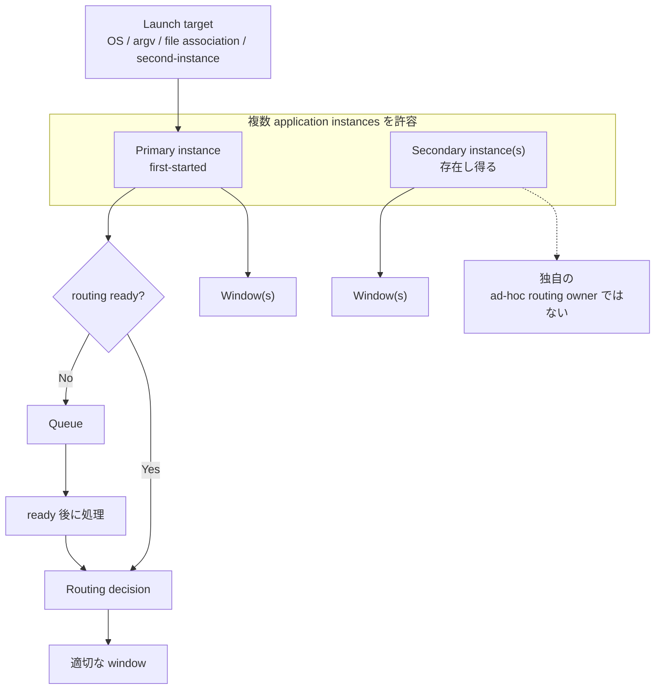
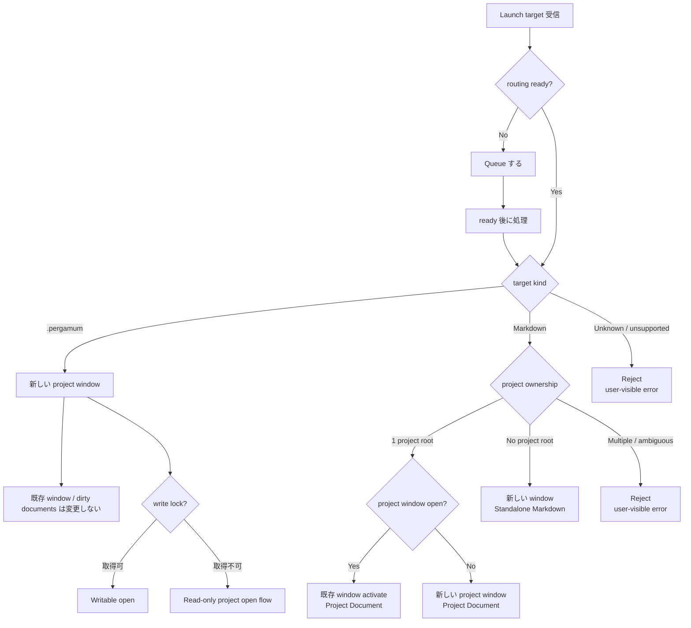
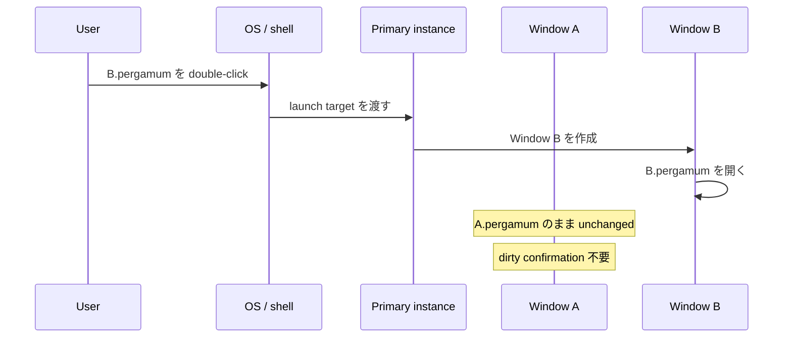
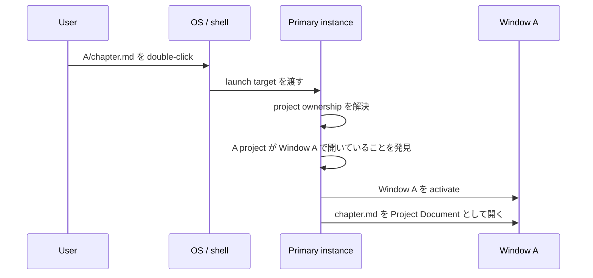
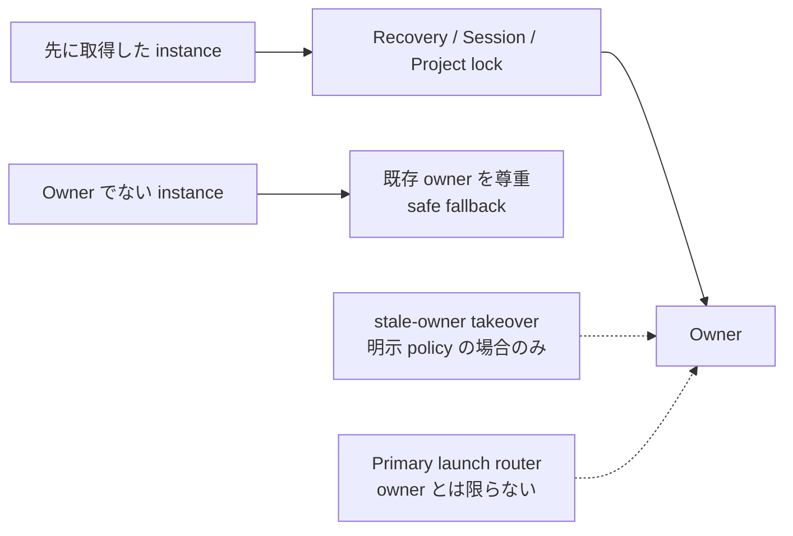

# ADR-0012: アプリケーションインスタンスと起動対象ルーティング方針

**Status:** Proposed

**Date:** 2026-09-02

> Status について: 本 ADR は Issue #278 の policy / architecture decision を明文化する。実際の `second-instance` wiring、primary handoff、routing queue、window registry は未実装であり、後続 Issue で扱う。PO review 後に Accepted 化を検討する。

---

## Context

Pergamum は現行実装では概ね次の構成で動作している。

```text
1 process
  └ 1 BrowserWindow
      └ 1 Session
```

一方、Pergamum は strict single-app-instance model を採用しておらず、複数の application process を同時に起動できる。

```text
Pergamum process A
  └ Session A

Pergamum process B
  └ Session B
```

#272 で Session restore-set persistence が導入され、複数 process がそれぞれ Session を persist した場合でも restore-set に複数 Session が存在し得る。#274 では現行 single-window architecture に合わせ、cold start 時に restore する Session は最大 1 件とした。ADR-0010 は cold start の file-open routing を定義したが、runtime `second-instance` / macOS `open-file` / 既存ウィンドウへの focus / routing / instance registry は future work として残していた。

Issue #278 はこの未確定領域、すなわち **Pergamum がすでに起動している状態で OS / command line / file association から渡された launch target を、どの process / window / Session に届けるか**を定義する。

この ADR は実装を追加しない。Pergamum の application instance model と launch target routing policy を先に固定し、後続実装 Issue が ad-hoc な routing policy を増やさないようにする。

### 全体像の概念図

以下の図は、application instance、primary routing、routing ready、queue、window の関係を示す。



---

## Related ADRs

- **ADR-0003 UI Interaction Architecture** - renderer / main boundary、project state / current document / open document state separation を前提として使用する。本 ADR は ADR-0003 の frozen interaction invariants を変更しない。
- **ADR-0006 Durable State Categories and Settings Architecture** - session / recovery / runtime coordination が settings とは別カテゴリであることを前提として使用する。
- **ADR-0007 Recovery and Runtime Coordination** - multi-instance で Recovery を分離する方針、runtime coordination marker は advisory signal であり hard lock ではない方針を前提として使用する。本 ADR は Recovery ownership を再設計しない。
- **ADR-0008 Project File, Project Root, and Project-Local Recovery Layout** - `.pergamum` project file、project root、project boundary、`metadata.project_id`、project root を lock / multi-open 判定単位とする前提を使用する。
- **ADR-0009 Working Copy Persistence and Recovery Model** - working copy Recovery の非破壊 contract、`sessionId` と `instanceRunId` の分離、multi-instance claim 方針を変更しない。
- **ADR-0010 Startup File-Open Routing (Cold Start)** - cold start の `.pergamum` / Markdown routing、URL-like input rejection、project-owned Markdown を standalone writable に fallback しない安全条件を前提として使用する。本 ADR は ADR-0010 が future work とした runtime / already-running instance routing policy を定義する。

---

## Definitions

**Application instance**

1 つの Pergamum application process / run。`instanceRunId` で表現される実行単位に対応する。1 application instance は将来複数 window を持ち得るが、window / Session とは同一概念ではない。

**Primary instance**

最初に起動した到達可能な Pergamum application instance。Launch target routing の代表窓口として振る舞う。Primary liveness / stale-primary takeover の具体条件は本 ADR では定義しない。

**Launch target**

OS / command line / file association / Electron `second-instance` style handoff / 将来の macOS `open-file` などから渡される file-open request。対象は `.pergamum` project file または Markdown file である。

**Routing ready**

Primary instance が startup / Session restore を終え、incoming launch target の routing decision を安全に実行できる lifecycle point。具体的な ready 判定は後続 Issue が定義する。

**Project Document / Standalone Markdown**

ADR-0010 の document kind 定義を使用する。Project Document は Pergamum project に属する Markdown document、Standalone Markdown は project に属さない外部 Markdown document である。

---

## Decision

### Application instance model

**AIR-1. Pergamum は複数 application instances を許容する。**

Pergamum は strict single-app-instance model を採用しない。複数の application process / run が存在し得ることを正式な前提として扱う。

**AIR-2. File-open launch target は、可能な限り first-started primary instance へ route する。**

OS file association、command line、Electron `second-instance` style launch target、将来の macOS `open-file` などで渡された file-open request は、可能な限り first-started primary instance へ届ける。

これは strict single-instance enforcement ではない。Primary instance は launch target routing の代表窓口であり、他の application instances の存在そのものを禁止しない。

**AIR-3. Primary instance が launch-routing decision を所有する。**

Launch target を受け取った primary instance は、target の種類と project ownership に基づいて、既存 window を activate するか、新しい window を開くか、拒否するかを決定する。

後続 process / secondary instance が独自に random process selection や ad-hoc routing を行ってはならない。

**AIR-4. Routing ready 前の incoming launch target は queue する。**

Primary instance が startup / Session restore 中で routing ready になっていない場合、incoming launch target は queue しなければならない。

Startup / Session restore が進行中であることだけを理由に launch target を drop してはならない。Queued launch target は routing ready 後に処理する。

Queue の物理実装、ordering、deduplication、failure handling は後続 Issue で定義する。

**AIR-5. Launch routing は既存 window の dirty working copy を黙って破棄しない。**

Launch target routing を理由に、既存 window の Project / Session / dirty working copy を暗黙に置き換えてはならない。

`.pergamum` launch target は既存 window の Project switch ではない。Project switch という語を使う場合は、別途その意味を明確に定義しなければならない。

### Launch target routing flow

以下の図は、launch target を受け取った後の policy decision flow を示す。



---

### `.pergamum` launch targets

**PERGAMUM-1. Primary instance が `.pergamum` launch target を受け取った場合、target project を新しい window で開く。**

既存 window に開かれている project を置き換えない。

Cold start では、その起動によって最初に作られる window が target project window になってよい。Already-running 状態で既存 window がある場合は、新しい window を作る。

**PERGAMUM-2. 既存 window と dirty documents は変更しない。**

`.pergamum` launch target は既存 window の Project switch ではないため、既存 window の dirty confirmation は不要である。

**PERGAMUM-3. 同じ project がすでに開いていても、新しい window を開く試みを行う。**

同じ project が別 window または別 instance ですでに開いている場合でも、launch target は「既存 window を activate して終わり」ではなく、新しい window で開く試みを行う。

その後は既存の Project write lock / read-only project open policy が適用される。

- target project の write lock を取得できる場合、writable として開く。
- write lock がすでに所有されている場合、既存の read-only project open flow に従う。

Routing を理由に Project write lock を steal してはならない。

**PERGAMUM-4. Project identity は `metadata.project_id` を正とする。**

`.pergamum` file path は locator であり、Project identity ではない。Project name も identity ではない。これは ADR-0008 の `metadata.project_id` 方針を使用する。

#### Example: different project

```text
Window A is open with A.pergamum.
User double-clicks B.pergamum.
The launch target is routed to the primary instance.
The primary instance opens a new Window B.
B.pergamum opens in Window B.
Window A remains unchanged.
```

#### Sequence: A.pergamum から B.pergamum を開く



#### Example: same project

```text
Window A is open with A.pergamum.
User double-clicks A.pergamum again.
Pergamum still attempts to open a new window.
If Window A owns the write lock, the new window follows the read-only project open policy.
```

---

### Markdown launch targets

**MD-1. Markdown launch target は project ownership によって分類する。**

Markdown launch target は、まず Project ownership によって分類する。

Project ownership が「ちょうど 1 つの Pergamum project」として安全に解決できる場合、その Markdown は Project Document として扱う。Project ownership を安全に一意決定できない場合、Pergamum は推測して Project Document にしてはならない。

**MD-2. Markdown file がちょうど 1 つの Pergamum project root 配下にある場合、その project へ route する。**

その Markdown file は Project Document として開く。

**MD-3. 対象 project がすでに window で開かれている場合、その existing project window を activate し、Markdown file をそこで開く。**

この場合、Markdown launch target は `.pergamum` launch target と異なり、新しい window を優先しない。対象 file が属する project の既存作業環境があるため、そこへ route する。

対象 project が複数 window で開かれている場合の selection policy は follow-up とする。

**MD-4. 対象 project が開かれていない場合、その project 用の新しい window を開き、Markdown file を Project Document として開く。**

Project open は既存の project-open lifecycle と Project write lock / read-only policy を迂回してはならない。

**MD-5. Markdown file が Pergamum project root 配下にない場合、Standalone Markdown document として新しい window で開く。**

Project がその file を所有しないため、Project Document に昇格しない。

**MD-6. Markdown file が複数の可能な Pergamum project roots 配下にある場合、ambiguous として拒否する。**

Nested project roots、複数の候補 project roots、または active project file を一意に決められない状態では、Pergamum は推測してはならない。User-visible error を提示し、何も開かない。

**MD-7. Same standalone Markdown file が別 window / process ですでに開いている場合の扱いは follow-up とする。**

Standalone Markdown の duplicate editor prevention / cross-process lock / activate policy は本 ADR では決めない。

#### Example: project-owned Markdown

```text
Window A is open with A.pergamum.
User double-clicks A/chapter.md.
Pergamum activates Window A.
chapter.md opens as a Project Document in Window A.
```

#### Sequence: project-owned Markdown を開く



---

### Ownership model

この図は、primary launch router と各 ownership が同一とは限らないことを示す。



**OWN-1. Recovery ownership は first-come-first-served である。**

Relevant Recovery ownership / claim を先に取得した instance が owner になる。他 instance は既存 owner を尊重し、Recovery policy に従って safe fallback しなければならない。

**OWN-2. Session persistence ownership は first-come-first-served である。**

Session persistence に関する ownership / write authorization を先に取得した instance が owner になる。他 instance は、明示された coordination policy なしに Session を merge / repair / steal してはならない。

**OWN-3. Project write lock ownership は first-come-first-served である。**

Project write lock を先に取得した window / instance が writable owner になる。他 window / instance は既存の read-only project open policy に従う。

**OWN-4. Stale-owner takeover は、明示された stale-owner policy がある場合だけ許可する。**

既存 owner が死んだと確認できる stale-owner policy が明示されていない限り、Recovery ownership、Session persistence ownership、Project write lock ownership を steal してはならない。

**OWN-5. Primary launch router は Recovery / Session / Project write lock owner であるとは限らない。**

Primary instance は launch target routing の代表窓口である。Primary であることは、Recovery ownership、Session persistence ownership、Project write lock ownership を自動的に得ることを意味しない。

---

### Session, window, and lifecycle implications

**LIFE-1. `sessionId` は logical working environment identity、`instanceRunId` は process/run identity である。**

ADR-0009 / #274 の contract を維持する。Restored Session は同じ `sessionId` を保持し、新しい run では新しい `instanceRunId` を持つ。

**LIFE-2. Launch target を unrelated Session に暗黙 merge してはならない。**

`.pergamum` launch target は既存 window の unrelated Session を置き換えない。Markdown launch target は project ownership に従って route する。Routing を理由に unrelated Session の open editors / dirty state を黙って変更してはならない。

**LIFE-3. Window は launch target routing の endpoint である。**

`.pergamum` target は新しい project window、project-owned Markdown は対象 project の existing window または新しい project window、standalone Markdown は新しい standalone window に route される。

Per-window Session ownership、multi-Session restore、window registry の具体実装は後続 Issue が所有する。

**LIFE-4. Window Close と Application Quit は同一視しない。**

将来の multi-window 実装では、non-final Window Close はその window / Session の close であり、Application Quit ではない。Final window close、explicit Quit、platform-specific quit behavior の詳細は後続 Issue で既存 lifecycle と整合させる。

**LIFE-5. Close Project は Project switch や deletion ではなく detach である。**

Launch routing は Close Project の意味を変更しない。`.pergamum` launch target を受けた既存 window に対して、暗黙の Close Project / Project switch を実行してはならない。

---

### Platform entry points

**PLAT-1. Windows / Linux の file association、shell double-click、argv、Electron `second-instance` style entry point は同じ routing policy へ正規化する。**

OS ごとに異なる entry point であっても、Pergamum の application instance model を分岐させない。

**PLAT-2. macOS `open-file` は将来同じ launch target routing policy に載せる。**

macOS 固有の event ordering、Dock activation、already-running app への file-open delivery は後続実装 Issue で扱う。ただし application model は本 ADR と同じにする。

**PLAT-3. Routing failure は user-visible にする。**

Primary handoff failure、ambiguous project ownership、target not found、read-only open failure などの失敗を silent に無視してはならない。具体的な error UI / retry policy は後続 Issue で定義する。

---

## Consequences

### Positive

- Pergamum は複数 application instances を許容しつつ、file-open launch target の routing owner を primary instance に一本化できる。
- `.pergamum` launch target が既存 window の Project switch にならないため、既存 window の dirty working copy を黙って破棄する経路を作らない。
- `.pergamum` と Markdown の routing policy が分離される。Project file は新しい project window、project-owned Markdown は既存 project window への activation を優先する。
- Project write lock / read-only policy、Recovery ownership、Session persistence ownership を launch routing が迂回しない。
- ADR-0010 の cold-start safety を、runtime / already-running instance routing の設計にも接続できる。
- Launch routing はユーザーの起動意図を適切な window へ届けるための機構であり、既存作業環境を暗黙に整理・統合・最適化するための機構ではない。

### Negative / Trade-offs

- Strict single-instance model より routing 実装が複雑になる。Primary handoff、routing queue、routing-ready lifecycle、window registry、stale-primary takeover が必要になる。
- `.pergamum` を同じ project に対して再度開いた場合でも新しい window を試みるため、read-only windows が増える可能性がある。
- Markdown と `.pergamum` で duplicate handling が異なる。Project-owned Markdown は既存 project window に route する一方、`.pergamum` は新しい window を試みる。
- Primary instance が他 instance / window の状態を把握するための registry が未実装であり、実装 Issue で race と failure を扱う必要がある。
- Standalone Markdown の duplicate editor / cross-process lock は未決のまま残る。

---

## Alternatives Considered

### Strict single-app-instance model

却下する。

Application model は単純になるが、`.pergamum` launch target が既存 window の Project switch になりやすく、dirty working copy / Session / Project switch confirmation の問題を file association routing に持ち込む。複数作業環境を並行利用する逃げ道も狭くなる。

### Launch target を受け取った process がそのまま処理する

却下する。

OS file association や `second-instance` 相当の request が process ごとに ad-hoc に処理されると、同じ target の duplicate open、random process selection、Project write lock / Session restore-set との不整合が起こりやすい。

### `.pergamum` launch target を既存 window の Project switch として扱う

却下する。

Project switch は既存 window の current project / dirty working copy / Session を置き換える操作であり、file association からの `.pergamum` open と同一視しない。`.pergamum` launch target は新しい project window に route する。

### `.pergamum` launch target が既存 same-project window を activate して終わる

却下する。

本 ADR では `.pergamum` file-open request を「その project を別 window で開く」要求として扱う。同じ project がすでに開かれている場合でも、新しい window を試み、その後は write lock / read-only policy に従う。

### Ambiguous Markdown project ownership を推測する

却下する。

Nested roots、複数 project candidates、active project file を一意に決められない状態で Project Document に昇格すると、誤った Project / Session / lock policy に接続される。Ambiguous な Markdown launch target は reject する。

---

## Non-goals

本 ADR は routing behavior を実装しない。

本 ADR は以下を導入しない。

- full multi-window editor/tab detach implementation
- tab detach / redock
- editor groups
- opening the same document in multiple writable editor views
- OS clipboard integration
- external drag-and-drop import
- migration runner
- new project DB schema changes

---

## Follow-up / open implementation issues

- actual Electron `second-instance` wiring
- primary-instance handoff mechanism
- routing queue implementation
- routing-ready lifecycle point
- primary liveness / stale-primary takeover policy
- window registry for locating an already-open project window
- handling multiple read-only windows for the same project
- same standalone Markdown file already open in another window
- user-facing errors when routing fails
- tests for launch routing behavior
